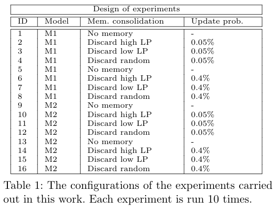

This repository contains the code that has been used in an experiment on training a LSTM network in an online fashion using an episodic memory system. Different strategies for updating the episodic memory systems are being tested, including one that assigns to memory elements a value that depends on the expected learning progress that this item will produce in a subsequent fit.

A paper describing a preliminary version of this code can be found here:
Miranda, L., Schillaci, G.,Adaptive architecture towards portability of greenhouse models, (to appear in) Proceedings of Greensys 2019 – Int. Symposium on Advanced Technologies and Management for Innovative Greenhouses, Angers, France, 2019. 
https://arxiv.org/pdf/1908.01643.pdf

# Diagrams of the neural networks adopted in the paper

## Model 1:

## Model 2:

# Experiments configurations

# Tables accompanying the paper
Tables  illustrate  the  results  of  the  quantitative  analysis  on  the  comparison  between  the discard_low_LP and discard_random consolidation strategies under the four different configurations of the experiments. Periods P1, P2, P3, P4 indicate when the learning algorithm is exposed to training data from, respectively, GH1 dataset, GH2 (year 2015) dataset, GH2 (year 2016) dataset and GH3 dataset. Similarly, rows indicate which test dataset has been used to calculate the MSE for each of the two experiments in the corresponding table.  A linear regression is calculated on each MSE curve.

For each of the experiments comparison, the slope difference is reported (slope of 
