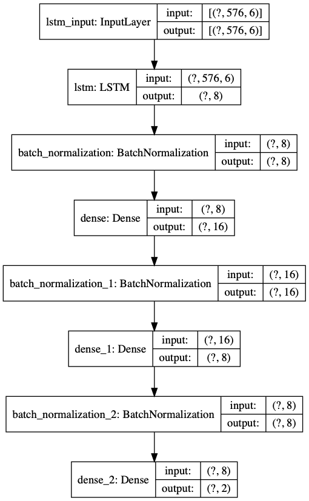

This repository contains the code that has been used in an experiment on training a LSTM network in an online fashion using an episodic memory system. Different strategies for updating the episodic memory systems are being tested, including one that assigns to memory elements a value that depends on the expected learning progress that this item will produce in a subsequent fit.

A paper describing a preliminary version of this code can be found here:
Miranda, L., Schillaci, G.,Adaptive architecture towards portability of greenhouse models, (to appear in) Proceedings of Greensys 2019 – Int. Symposium on Advanced Technologies and Management for Innovative Greenhouses, Angers, France, 2019. 
https://arxiv.org/pdf/1908.01643.pdf

# Diagrams of the neural networks adopted in the paper

## Model 1:

## Model 2:

